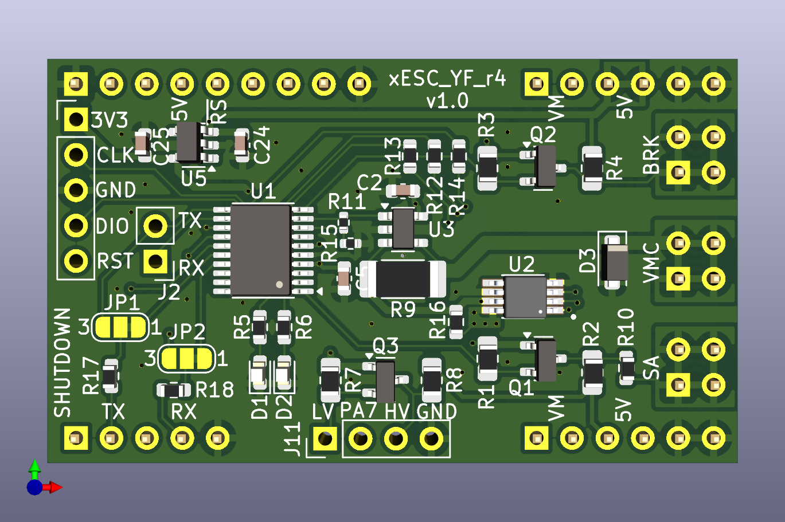
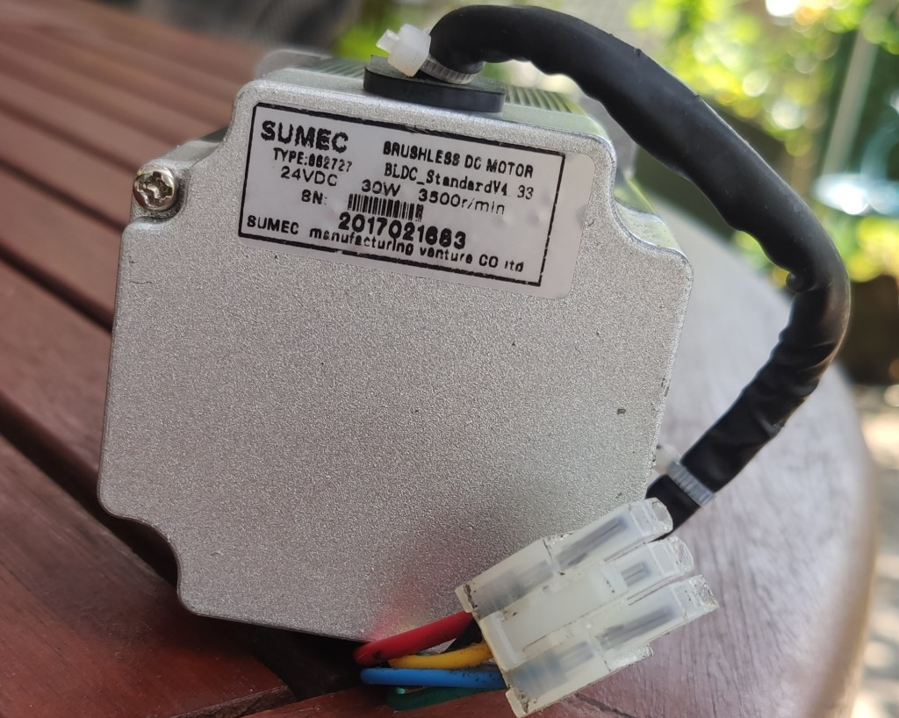
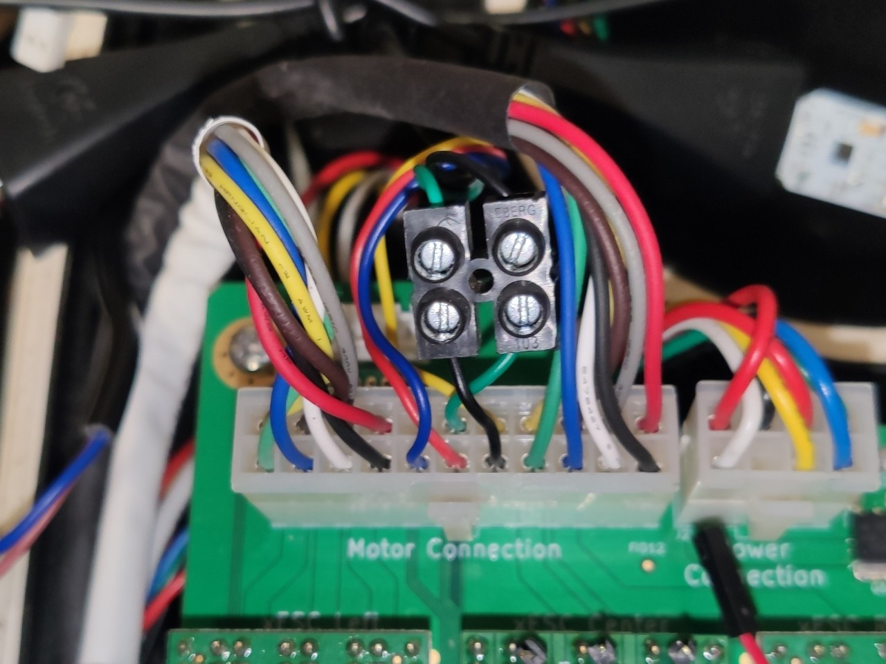

<a name="readme-top"></a>

<!-- PROJECT SHIELDS -->
<!--
- Markdown "reference style" links for readability.
- Reference links are enclosed in brackets [ ] instead of parentheses ( ).
  (See the bottom of this document for the declaration of the reference variables)
-->
[![Contributors][contributors-shield]][contributors-url]
[![Forks][forks-shield]][forks-url]
[![Stargazers][stars-shield]][stars-url]
[![Issues][issues-shield]][issues-url]
[![MIT License][license-shield]][license-url]


<!-- PROJECT LOGO -->
<br />
<div align="center">
<h3 align="center">xESC YardForce (Rev4) adapter for <a href="https://github.com/ClemensElflein/OpenMower">OpenMower</a></h3>

  <p align="center">
    Simple xESC adapter for stock Rev4 (built 2017) blade-motor<br>
    (the one with a internal motor controller under his cap)
    <br />
  </p>

  <a href="https://github.com/ClemensElflein/xESC_YF_rev4-adapter">
    
  </a>


</div>


<!-- ABOUT THE PROJECT -->
## About The Project

<a href="assets/rev4-mow-motor.jpg">
  </a>

Those who want use <a href="https://github.com/ClemensElflein/OpenMower">OpenMower</a> with an older YardForce "Rev. 4" (built 2017) model, fail with the stock Blade-Motor as it has an embedded motor-controller under it's cap.

It's not very difficult to use this motor:
- Remove stock driver controller
- Wire the coil cables directly
- Add a 5 pin cable to the motor hall sensors
- Connect them to OM's mow-motor-hall-input plug
and use OM's xESC.

But it's somehow "crafted" and you need to be capable to do these things.

As an alternative, this "Adapter" is thought to replace OM's default Mow- xESC.<br>
In addition to this adapter, it's nevertheless **required to exchange two cables of the mow motor cabling**. But this should be also possible for the untalented (see [Requirements](#requirements)).


<p align="right">(<a href="#readme-top">back to top</a>)</p>


## Requirements


<a href="assets/cross-gn-bk.jpg">
  </a>

**It's mandatory to cross the green and black mow-motor-cables!**

> [!WARNING]  
> **Never** plug or un-plug the mow-motor while the adapter is powered!

> [!WARNING]  
> Do **not** simply trust the cable colors!<br>
> Check the image and validate if your
> cables do have the same colors! If not adapt accordingly

Either exchange the pins within the plug, or do it the lazy way like me, with a luster terminal.
The latter has the advantage that you immediately see that you already crossed green/black.

## Prerequisites

* The compiled firmware, which can be found within the [Actions](https://github.com/ClemensElflein/xESC_YF_rev4-adapter/actions) section. Click the one you're intersted in (newest or tagged), scroll down to 'Artifacts', download and unzip to somewhere.
* As of writing, your openmower image has to be on edge version >= commit [0bfd489](https://github.com/ClemensElflein/open_mower_ros/commit/0bfd489401b3e659d183e6c1f9b557cb0d59d3c1) which happened on 2024-07-04

## Firmware Installation

We've two options to install the firmware. Either via:<br>
- ST-Link debugger/programmer, for which you need to have access to the adapter PCB's SWDIO pins, or via
- Open-Mower's UART via STM32 internal bootloader (which can be done with a closed mower)


### Firmware Installation via ST-Link debugger/programmer

#### Requirements

* You need an ST-Link debugger/programmer, like one of the cheap "ST-Link V2" probes from one of the big online retailer.
* [STLINK Tools](https://github.com/stlink-org/stlink) >= v1.8.0 (earlier versions do **not** support the used STM32C0x MCU)

#### Flash

1. Connect your ST-Link probe to the adapter PCB. Do **not** connect the 3.3V pin if your adapter is already assembled to the OpenMower Mainboard and get powered by it!

2. Flash the adapter:
   ```sh
   st-flash --reset write firmware_xesc_yf_rev4.bin 0x08000000
   ```
   When done, st-flash should report 'Flash written and verified! jolly good!' (or similar) and immediately reboot.<br>

   > [!WARNING]  
   > Do not unplug now!
   
   On first firmware boot, it need to flash some settings to the MCU. You'll see some blink codes.<br>
   Do NOT unplug till you see:
   - 3 simultaneous blinks of the green+red LED (=success), following of a
   - quick blink of the red LED (=no motor connected) as well as a
   - normal green blink (=ROS not connected).
   
   The whole procedure will only take about 10 seconds.

   If the board doesn't come up with blink signs, unplug and replug it. But once you see blink signs, do **not** unplug it before getting the described LED codes of the previous paragraph.   

<p align="right">(<a href="#readme-top">back to top</a>)</p>

### Firmware Installation via serial connection (UART)

#### Requirements

* [STM32CubeProgrammer](https://www.st.com/en/development-tools/stm32cubeprog.html) is the tool we need to flash via UART. But because we like to use it with our OpenMower's Raspberry-Pi, we need it in `aarch64` architecture. **BUT** ST's programmer tool for ARM CPU's isn't available *for* ARM CPU's/architectures!!<br>
So we need to trick, and for this you need a non-arm Linux machine.<br>
  1. Download the `STM32CubePrg-Lin` package with (or to) a non-arm Linux machine
  2. Unpack and install it on the non-arm Linux machine
  3. Pack (zip, tar, ...) the installed binaries from where you just installed them
  4. Copy that package to your Raspberry-Pi and unpack it to somewhere. I placed mine to /opt/STM32CubeProgrammer
* [box64](https://github.com/ptitSeb/box64) to be able to run the STM32CubeProgrammer x86_64 binary with our aarch64 architecture.<br>
Luckily they do have pre-build [Debian packages](https://github.com/ptitSeb/box64/blob/main/docs/COMPILE.md#debian-based-linux). Please follow that instruction.

Once *box64* got installed you should be able to start the STM32Programmer CLI i.e. via: `/opt/STM32CubeProgrammer/bin/STM32_Programmer_CLI`


### Flash

1. Login to your OpenMower Raspberry-Pi and stop openmower:<br>
   `sudo systemctl stop openmower`
   
2. Configure Raspberry-PI's serial device where the adapter is connected to, which is normally */dev/ttyAMA3*:<br>
   `stty -F /dev/ttyAMA3 115200 raw`
   
3. Now trigger the current running adapter firmware to do a reboot into the bootloader via:<br>
    `echo -e "\x00Reboot into Bootloader" > /dev/ttyAMA3`

4. Check if STM32 MCU is now in bootloader mode (Step 3. was successful):<br>
   `/opt/STM32CubeProgrammer/bin/STM32_Programmer_CLI -c port=/dev/ttyAMA3`<br>
   Should output something like:<br>

   ```
      -------------------------------------------------------------------
                        STM32CubeProgrammer v2.16.0                  
      -------------------------------------------------------------------

   Serial Port /dev/ttyAMA3 is successfully opened.
   Port configuration: parity = even, baudrate = 115200, data-bit = 8,
                       stop-bit = 1.0, flow-control = off
   Activating device: OK
   Board       : --
   Chip ID: 0x443 
   BootLoader protocol version: 3.1
   Device name : STM32C01x
   Flash size  : 32 KBytes (default)
   Device type : MCU
   Revision ID : --  
   Device CPU  : Cortex-M0+
   ```

5. Flash:<br>
   `/opt/STM32CubeProgrammer/bin/STM32_Programmer_CLI -c port=/dev/ttyAMA3 -w firmware_xesc_yf_rev4.bin 0x08000000`

6. Reset the device (start our newly flashed program):<br>
   `/opt/STM32CubeProgrammer/bin/STM32_Programmer_CLI -c port=/dev/ttyAMA3 --go 0x08000000`

   > [!WARNING]  
   > Do not power-off now!
   
   On first firmware boot, it need to flash some settings to the MCU. You'll see some blink codes.<br>
   Do NOT unplug till you see:
   - 3 simultaneous blinks of the green+red LED (=success), following of a
   - quick blink of the red LED (=no motor connected) as well as a
   - normal green blink (=ROS not connected).
   
   The whole procedure will only take about 10 seconds.

7. Finally start openmower again:<br>
   `sudo systemctl start openmower`


<p align="right">(<a href="#readme-top">back to top</a>)</p>


## mower_config

Lastly, you need to add the adapter to your mower_config. Here's the relevant section out of mower_config.sh.example:

```
# Select your ESC type
# Supported values as of today:
# xesc_mini: for the STM32 version (VESC)
# xesc_mini_w_r4ma: for the STM32 version (VESC), but with Rev4 (Mow) Motor Adapter (only available for YardForceSA650 mower type)
# xesc_2040: for the RP2040 version (very experimental!)
# xesc_2040_w_r4ma: for the RP2040 version (very experimental!), but with Rev4 (Mow) Motor Adapter (only available for YardForceSA650 mower type)
export OM_MOWER_ESC_TYPE="xesc_mini"
```

Once adapted, restart openmower via: `sudo systemctl restart openmower`

<p align="right">(<a href="#readme-top">back to top</a>)</p>


## LED codes

<table>
  <tr><th>Green</th><th>Red</th><th>Description</th></tr>
  <tr><td></td><td>5 * blink</td><td>NRST Pin not yet disabled. <b>Keep board powered</b> and watch for further LED codes</td></tr>
  <tr><td>5 * blink</td><td></td><td>NRST successful flashed</td></tr>  <tr><td colspan="2" align="center">3 * flash</td><td>'Power up' successful</td></tr>
  <tr><td>1Hz blink</td><td></td><td>Waiting for init by xesc_ros</td></tr>
  <tr><td>0.5Hz flash<br>(short flash every 2 seconds)</td><td></td><td>Shutdown (Sleep) triggered by OpenMower Pico FW</td></tr>
  <tr><td>on</td><td></td><td>All fine (initialized, xesc_ros connected and no error)</td></tr>
  <!-- <tr><td>flash</td><td></td><td>SA tacho flash for 90° rotation</td></tr> -->
  <tr><td></td><td>4Hz quick blink</td><td>Open VMC (no motor connected).<br> <b>WARNING:</b> Do not connect the motor while the adapter is powered!</td></tr>
  <tr><td></td><td>2Hz fast blink</td><td>VMS temperature issue or over-current detected</td></tr>
  <tr><td></td><td>1Hz blink</td><td>Waiting for OpenMower (xesc_ros driver) connect</td></tr>
  <tr><td></td><td>flash</td><td>One single short flash for every host communication error, like packet or CRC error</td></tr>
</table>

<p align="right">(<a href="#readme-top">back to top</a>)</p>


## Self-Compile

This project is build with [modm](https://modm.io). You need to install the required toolchain as described in their [Installation](https://modm.io/guide/installation/) section, before going on.

Once done:

1. Clone this repository (inclusive submodules):<br>
  `git clone --recurse-submodules https://github.com/ClemensElflein/xESC_YF_rev4-adapter.git`
2. Change into the project source directory:<br>
  `cd xESC_YF_rev4-adapter/firmware/src`
3. Build the modm library files:<br>
  `lbuild build`
4. Compile the firmware binary:<br>
  `scons bin`
5. Flash firmware:<br>
  For this, a specific [xPack OpenOCD](https://xpack-dev-tools.github.io/openocd-xpack/) version is required. Either install your own one, or use the one within the package folder by:<br>
  `export MODM_OPENOCD_BINARY=../packages/xpack-openocd-0.12.0-3-linux-x64/bin/openocd`<br>
  Afterwards flash the firmware via:<br>
  `scons program`

<p align="right">(<a href="#readme-top">back to top</a>)</p>


## Roadmap

(Ordered by priority)

- [x] Design schematics and PCB 
- [x] Produce PCB
- [ ] Firmware 
    - [x] Generic VM control (on/off)
    - [x] Generic motor control (start, stop, break)
    - [x] Read SA, math RPM
    - [x] Open VMC (no motor connected) detection
    - [ ] ~~VMC-short and thermal error handling of VM-Switch~~
    - [x] Disable NRST pin functionality
    - [x] Motor current consumption
    - [x] PCB temperature (junction temp of STM)
    - [x] Support shutdown signal
    - [ ] Stock motor (wrong) cabling detection
    - [x] STM32 bootloader / flash via UART support
- [ ] ROS driver
    - [x] xesc_ros::xesc_yfr4
    - [ ] Add RPM

See the [open issues](https://github.com/ClemensElflein/xESC_YF_rev4-adapter/issues) for a full list of proposed features (and known issues).

<p align="right">(<a href="#readme-top">back to top</a>)</p>

## History

  | Version | Release Date | Info                                          |
  | ------- | :----------: | --------------------------------------------- |
  | 0.2.2   |  2024-08-??  | - Support STM32 bootloader flash via UART |
  | 0.2.1   |  2024-08-19  | - Add shutdown signal handling (sleep/power-off VMC)<br>- Handle over-temp and over-current |
  | 0.2.0   |  2024-08-16  | - Switch from Arduino to modm lib<br>- Integrate flash procedure to disable-NRST<br>- Add Motor current and PCB temperature |
  | 0.1.1   |  2024-07-10  | - Open VMC (no motor connected) detection<br>- VMC-short and thermal error detection |
  | 0.1.0   |  2024-07-05  | Generic functionality like Start, Stop, Break |


<p align="right">(<a href="#readme-top">back to top</a>)</p>


<!-- CONTRIBUTING -->
## Contributing

Contributions are what make the open source community such an amazing place to learn, inspire, and create. Any contributions you make are **greatly appreciated**.

If you have a suggestion that would make this better, please fork the repo and create a pull request. You can also simply open an issue with the tag "enhancement".
Don't forget to give the project a star! Thanks again!

1. Fork the Project
2. Create your Feature Branch (`git checkout -b feature/AmazingFeature`)
3. Commit your Changes (`git commit -m 'Add some AmazingFeature'`)
4. Push to the Branch (`git push origin feature/AmazingFeature`)
5. Open a Pull Request

<p align="right">(<a href="#readme-top">back to top</a>)</p>


<!-- LICENSE -->
## License

Distributed under the MIT License. See `LICENSE.txt` for more information.

<p align="right">(<a href="#readme-top">back to top</a>)</p>


<!-- CONTACT -->
## Contact

Project Link: [https://github.com/ClemensElflein/xESC_YF_rev4-adapter](https://github.com/ClemensElflein/xESC_YF_rev4-adapter)

<p align="right">(<a href="#readme-top">back to top</a>)</p>


<!-- ACKNOWLEDGMENTS -->
<!--
## Acknowledgments

* []()
* []()
* []()

<p align="right">(<a href="#readme-top">back to top</a>)</p>
->


<!-- MARKDOWN LINKS & IMAGES -->
<!-- https://www.markdownguide.org/basic-syntax/#reference-style-links -->
[contributors-shield]: https://img.shields.io/github/contributors/ClemensElflein/xESC_YF_rev4-adapter.svg?style=for-the-badge
[contributors-url]: https://github.com/ClemensElflein/xESC_YF_rev4-adapter/graphs/contributors
[forks-shield]: https://img.shields.io/github/forks/ClemensElflein/xESC_YF_rev4-adapter.svg?style=for-the-badge
[forks-url]: https://github.com/ClemensElflein/xESC_YF_rev4-adapter/network/members
[stars-shield]: https://img.shields.io/github/stars/ClemensElflein/xESC_YF_rev4-adapter.svg?style=for-the-badge
[stars-url]: https://github.com/ClemensElflein/xESC_YF_rev4-adapter/stargazers
[issues-shield]: https://img.shields.io/github/issues/ClemensElflein/xESC_YF_rev4-adapter.svg?style=for-the-badge
[issues-url]: https://github.com/ClemensElflein/xESC_YF_rev4-adapter/issues
[license-shield]: https://img.shields.io/github/license/ClemensElflein/xESC_YF_rev4-adapter.svg?style=for-the-badge
[license-url]: https://github.com/ClemensElflein/xESC_YF_rev4-adapter/blob/master/LICENSE.txt
